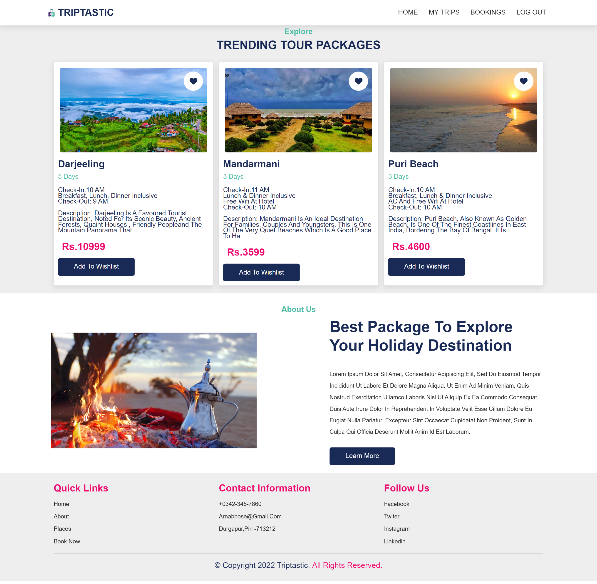
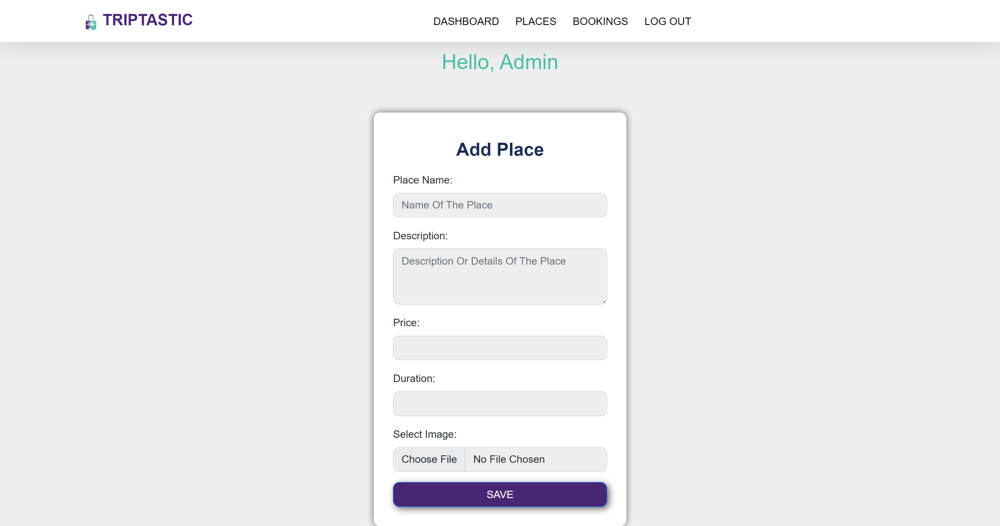
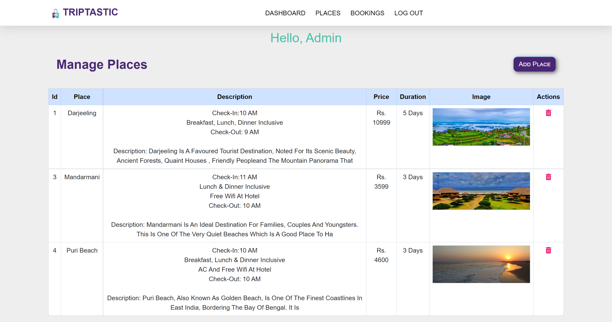
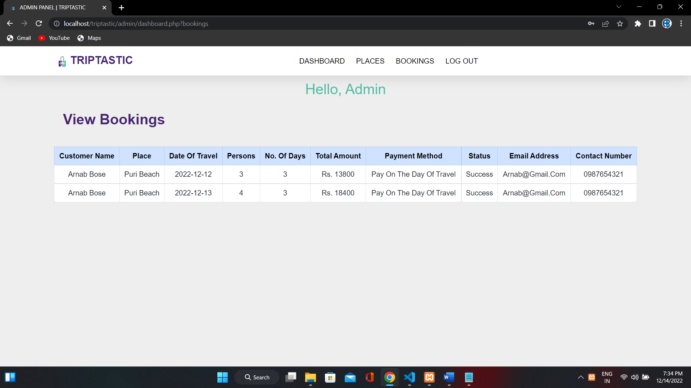
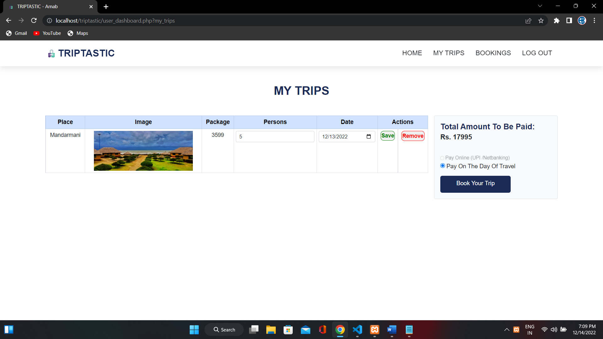
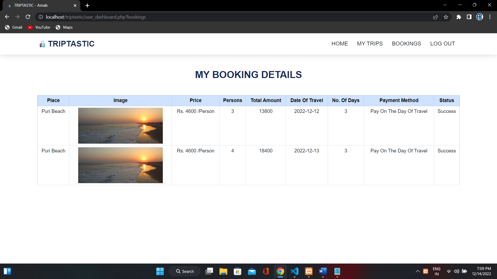

# Triptastic

Triptastic is a full-stack travel booking web application developed using PHP, MySQL, HTML, CSS, and JavaScript. The application allows users to explore travel destinations, manage bookings, maintain a wishlist, and access a personalized dashboard through an intuitive interface.

---

## Features

### User Module

- User Registration & Login
- Browse Travel Destinations
- User Dashboard
- Manage Wishlist
- Book Travel Packages
- View Booking History
- Logout Functionality

### Admin Module

- Secure Admin Login
- Manage Travel Packages
- Manage User Bookings
- Database Management

---

## Technologies Used

- PHP
- MySQL
- HTML5
- CSS3
- JavaScript
- Bootstrap

---

## Project Structure

```text
Triptastic
│
├── admin/
├── connection/
├── css/
├── database/
├── image/
├── index.php
├── login.php
├── signup.php
└── ...
```
---

## Screenshots

### Home Page


### Admin - Add Tour Package


### Admin - Update Tour Package


### Admin - Manage Bookings


### User - Wishlist


### User - Booking Details

